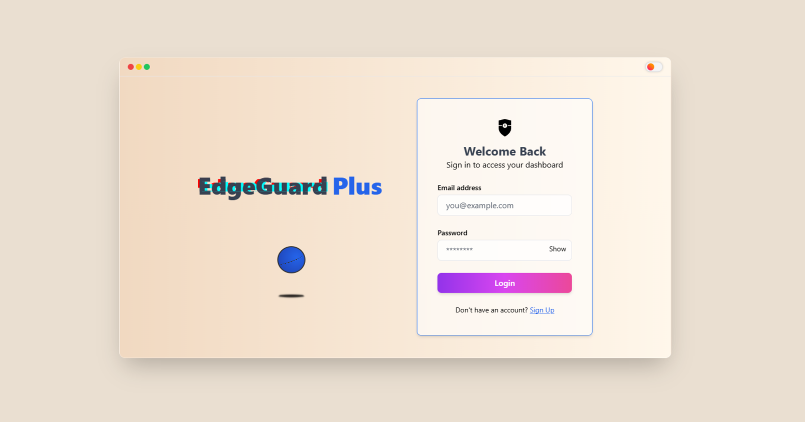
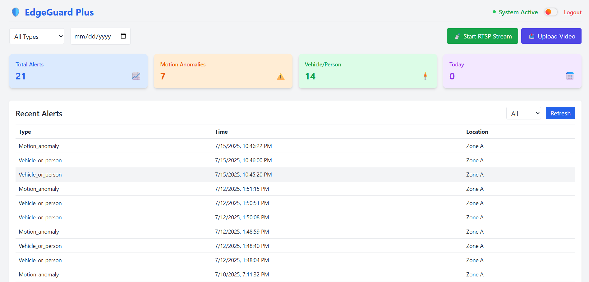
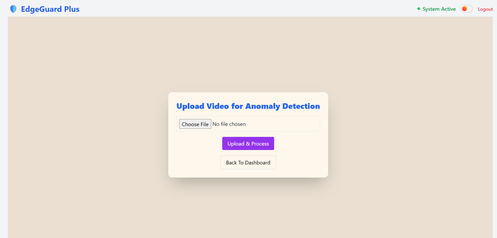
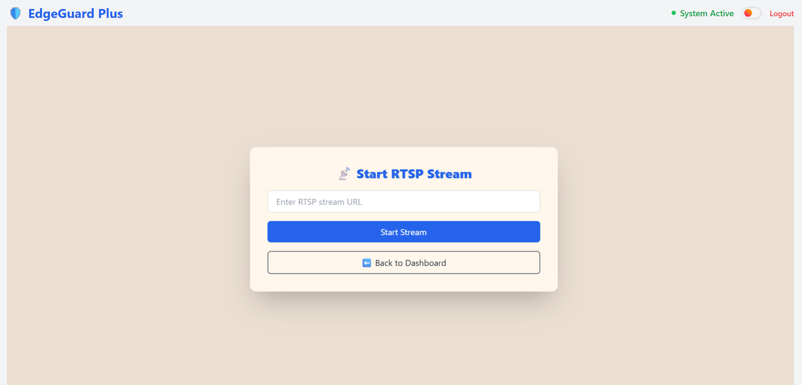

# 🛡️ EdgeGuard++  
**Smart, Privacy-First, Full-Stack Anomaly Detection Platform for Edge Devices**

> AI-powered, privacy-preserving system with real-time video analysis, DVR-style event capture, AES-encrypted metadata, Node.js + MongoDB backend, and a React-based dashboard.

---

## 🚨 Why EdgeGuard++?

Traditional surveillance systems stream raw video to the cloud, leading to:
- ⚠️ **Privacy breaches**
- 📶 **High bandwidth & cost**
- 🐌 **Increased latency**

**EdgeGuard++ solves this by:**
- Performing **AI inference on-device**
- Saving only **anomalous events (DVR-style)**
- Sending only **AES-encrypted metadata**
- Logging to **MongoDB via Node.js**
- Displaying events in a **React dashboard**

---

## 🎯 Core Features

| Module           | Capability                                                |
|------------------|-----------------------------------------------------------|
| 🎥 Input         | Webcam / video file / RTSP stream                         |
| 🧠 Detection     | CNN+LSTM anomaly detector                                 |
| 🎞️ DVR Buffer   | Saves 5s before and after anomaly                         |
| 🔐 Encryption    | AES-256 metadata encryption                               |
| ☁️ Sync          | Encrypted alerts via Express API                          |
| 🗃️ Storage       | MongoDB for alert/event logs                              |
| 📊 Dashboard     | Live alerts, playback, and filters (React.js)             |
| 🔁 WebSocket     | Real-time event streaming (planned)                       |

---

## 👨‍💻 Tech Stack

| Layer          | Stack / Tools                        |
|----------------|---------------------------------------|
| Inference      | Python, OpenCV, TensorFlow, NumPy     |
| Encryption     | PyCryptodome (AES-256)                |
| Backend API    | Node.js, Express.js                   |
| Database       | MongoDB (local / Atlas)               |
| Frontend       | React.js, Axios, Tailwind, Mapbox     |
| Model Training | TensorFlow, Keras                     |

---

## 📦 Installation Guide

### 1️⃣ Clone the Repo

```bash
git clone https://github.com/DaRKxLoRd18/EdgeGuard.git
cd EdgeGuard
```

### 2️⃣ Backend Setup

```bash
cd backend/
npm install
node server.js
```

> Make sure to create a `.env` file with:
```
MONGO_URI=your_mongodb_connection_string
PORT=5000
```

### 3️⃣ Frontend (Dashboard UI)

```bash
cd ../EdgeGuard-Plus/dashboard_ui
npm install
npm run dev
```

Visit the dashboard at [http://localhost:5173](http://localhost:5173)

### 4️⃣ Python (Inference)

Ensure you have Python 3.8+ installed. Then:

```bash
pip install -r requirements.txt
```


## 🖼️ Screenshots

### 🔐 Login Page  


---

### 📊 Dashboard  


---

### 📤 Upload Video  


---

### 📡 RTSP Streaming  


---


## 👤 Author

- [**Manveet Singh**](https://github.com/DaRKxLoRd18) 
- [**Mayank Gautam**](https://github.com/Mayankiiitd) 

---

## 📄 License

MIT License – Use freely with credit.
